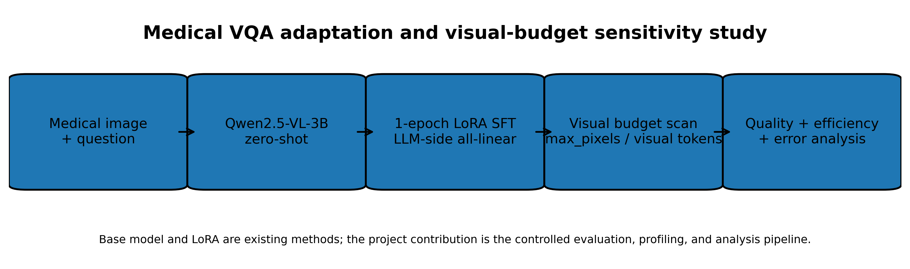
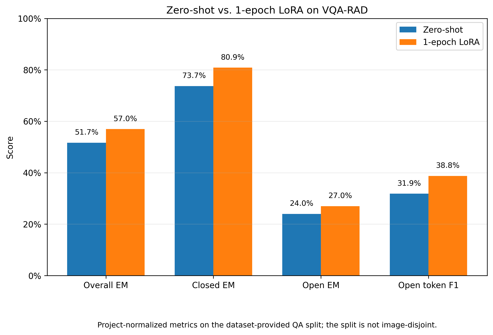
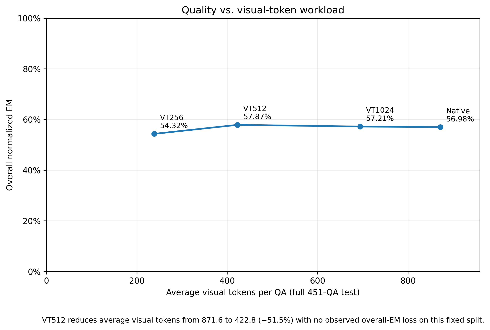
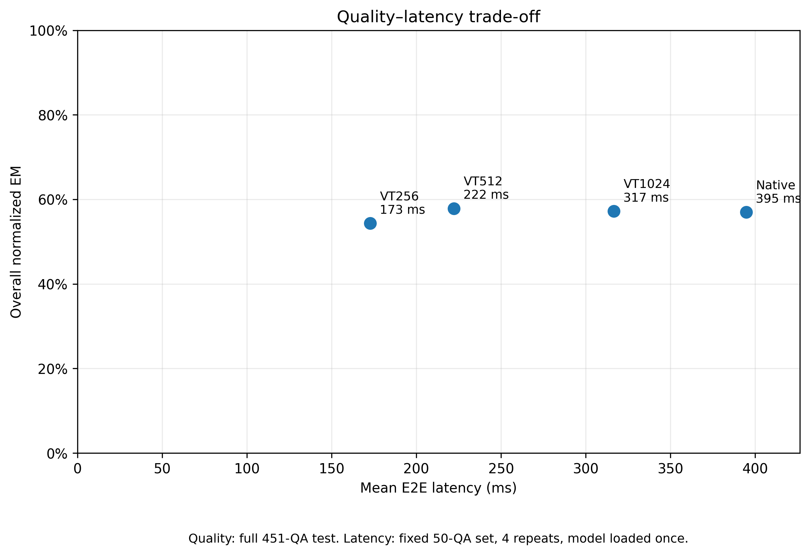
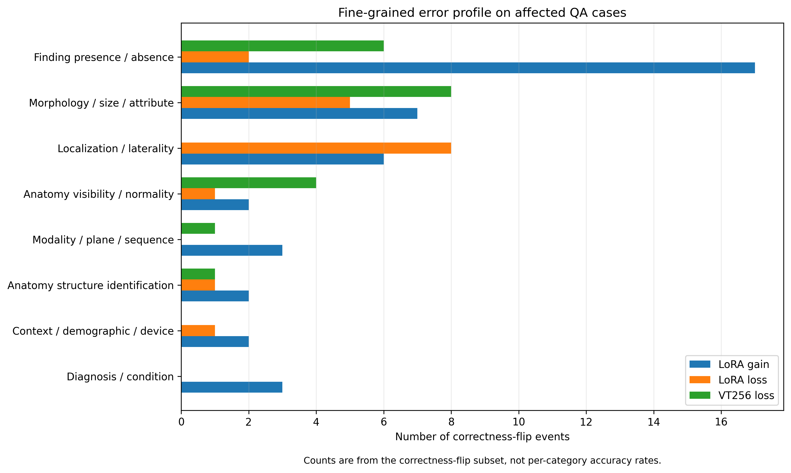
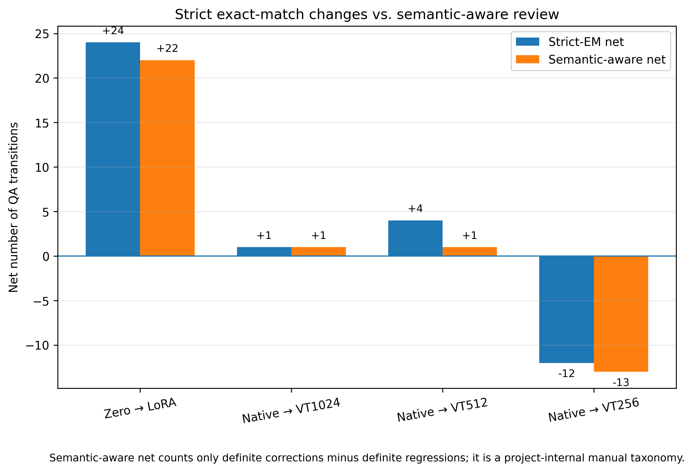
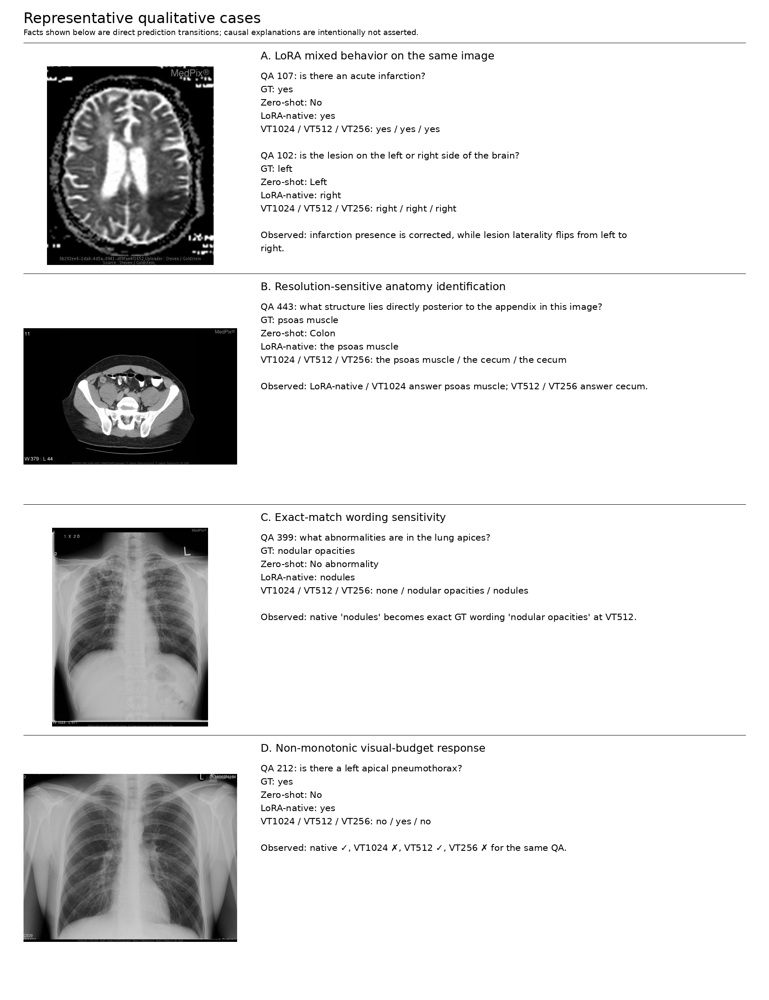

# Qwen2.5-VL Medical VQA：LoRA 领域适配与 Visual Token Budget 分析

> 基于 Qwen2.5-VL-3B-Instruct 搭建 Medical VQA 训练、评测与效率分析流水线，通过 1-epoch LoRA 进行领域适配，并系统研究 `max_pixels / visual-token budget` 对回答质量、推理时延和不同医学语义能力的影响。

<p align="center">
  
</p>

## 项目简介

这个项目关注两个实际问题：

1. **轻量领域适配是否能改善通用 VLM 在医学 VQA 上的回答表现？**
2. **视觉输入被压缩后，能节省多少推理成本，以及哪些医学问题最先受到影响？**

项目以 **Qwen2.5-VL-3B-Instruct** 为底座，在 **VQA-RAD** 上完成：

- Zero-shot baseline；
- 真实 LoRA multimodal SFT；
- 3 档 `max_pixels / visual-token budget` sensitivity experiment；
- visual token、latency 与 diagnostic memory profiling；
- closed / open question 分析；
- fine-grained semantic-target 与 correctness-transition analysis；
- representative success / failure / metric-artifact case study。

本项目的目标不是追求 VQA-RAD SOTA，也没有提出新的 VLM architecture 或 token-pruning method。重点是建立一个**可复现、可分析的 Medical VLM 实验闭环**，同时考察 quality–efficiency trade-off。

---

## 我做了什么

### Open-source / existing components

以下能力不是本项目提出的：

- Qwen2.5-VL-3B-Instruct 模型与其预训练能力；
- LoRA 参数高效微调方法；
- ms-swift / PEFT 等训练框架；
- VQA-RAD 数据集。

### My work

本项目实际完成的工作包括：

- 搭建 image → prompt → generation → normalization → metric 的完整 Medical VQA evaluation pipeline；
- 构建 VQA-RAD SFT 数据，并在 source-train 内执行 **image-level train/val split**；
- 完成 Qwen2.5-VL-3B 的 **1-epoch LLM-side LoRA SFT**；
- 固定 LoRA 模型，仅改变 `max_pixels`，完成多档 visual-token budget controlled experiment；
- 统计实际 visual-token workload，而不是只记录 nominal resolution；
- 实现固定 50-QA、warm-up + 4 repeats 的 latency benchmark；
- 分析 LoRA 和视觉压缩引起的 correctness gains / losses；
- 构建项目内部 fine-grained semantic taxonomy，并人工区分 strict-EM transition 与真实 semantic transition；
- 整理 representative success、failure、non-monotonic 和 metric-sensitive qualitative cases；
- 对数据 split 与 tokenizer warning 进行了发布前 validity audit。

---

## 方法与实验流程

```text
Medical Image + Question
        ↓
Qwen2.5-VL-3B-Instruct
        ↓
Zero-shot evaluation
        ↓
1-epoch LoRA SFT
        ↓
LoRA-native evaluation
        ↓
max_pixels / visual-token budget scan
        ↓
Quality + Latency + Error Analysis
```

LoRA 训练只更新 LLM 侧 `all-linear` LoRA 参数；vision encoder 与 aligner 冻结。

---

## 实验设置

| Item | Setting |
|---|---|
| Base model | Qwen2.5-VL-3B-Instruct |
| Dataset | VQA-RAD |
| Dataset-provided test | 451 QA |
| Closed / Open | 251 / 200 |
| SFT train / val | 1612 / 181 QA |
| SFT train / val unique images | 282 / 31 |
| Train–val image overlap | 0 |
| LoRA rank / alpha | 8 / 32 |
| LoRA dropout | 0.05 |
| Target modules | LLM-side `all-linear` |
| Vision encoder | Frozen |
| Aligner | Frozen |
| Learning rate | 1e-4 |
| Epoch | 1 |
| Per-device batch size | 1 |
| Gradient accumulation | 8 |
| Max sequence length | 4096 |
| Training precision | BF16 |
| Seed | 42 |
| Trainable parameters | 14.9668M / 3769.5898M = **0.3970%** |

### Evaluation protocol

主指标为项目内部的 **normalized exact match (EM)**：

- Closed questions：抽取第一个独立出现的 `yes / no`；
- Open questions：lowercase、去 punctuation、去 article、合并空格后做 exact match；
- Open token F1：仅作为 diagnostic metric。

因此本仓库的 EM/F1 用于**项目内部 controlled comparison**，不应直接视为 VQA-RAD 官方指标，也不用于宣称 literature SOTA。

---

## 核心结果：Zero-shot → LoRA

| Setting | Overall EM | Closed EM | Open EM | Open token F1 | Avg visual tokens |
|---|---:|---:|---:|---:|---:|
| Qwen2.5-VL-3B Zero-shot | 51.66% | 73.71% | 24.00% | 31.86% | 871.6 |
| + 1-epoch LoRA | **56.98%** | **80.88%** | **27.00%** | **38.76%** | 871.6 |
| Δ | **+5.32 pp** | **+7.17 pp** | **+3.00 pp** | **+6.90 pp** | — |

<p align="center">
  
</p>

在同一 test split、prompt、processor 与 evaluator 下，LoRA 的 overall normalized EM 从 **51.66% 提升到 56.98%**。

需要强调：该结果描述的是 **VQA-RAD dataset-provided QA split** 上的表现，而不是严格的 unseen-image generalization。

---

## Visual Token Budget：质量与压缩

固定 LoRA 模型，仅改变视觉输入的 `max_pixels`：

| Visual setting | `max_pixels` | Avg visual tokens | Overall EM | Closed EM | Open EM |
|---|---:|---:|---:|---:|---:|
| Native | default | 871.6 | 56.98% | 80.88% | 27.00% |
| VT1024 | 802,816 | 694.3 | 57.21% | 81.27% | 27.00% |
| VT512 | 401,408 | **422.8** | **57.87%** | 81.67% | 28.00% |
| VT256 | 200,704 | **238.4** | 54.32% | 75.70% | 27.50% |

相对 native：

- **VT512**：平均 visual tokens `871.6 → 422.8`，减少 **51.5%**；该固定 split 上未观察到 overall EM 损失；
- **VT256**：平均 visual tokens `871.6 → 238.4`，减少 **72.6%**，但 overall EM 下降 **2.66 pp**。

<p align="center">
  
</p>

这里不把 VT512 的 `57.87% > 56.98%` 解读为“压缩提高了医学能力”。后续 semantic-aware analysis 显示，其中一部分 strict-EM gain 来自 wording / granularity / label alignment。

---

## 推理效率

Latency 使用单独的 repeated benchmark：

- 固定 50 QA；
- model load once；
- 每个 condition warm-up 3 samples；
- 4 repeats；
- 4 个视觉预算轮换测试；
- CUDA synchronization；
- 不在 timing 内执行 `empty_cache`。

| Condition | Avg VT on benchmark50 | E2E mean | E2E median | E2E p95 | Paired mean E2E reduction vs native |
|---|---:|---:|---:|---:|---:|
| Native | 992.2 | 394.7 ms | 404.8 ms | 665.0 ms | — |
| VT1024 | 759.9 | 316.6 ms | 357.1 ms | 455.6 ms | 13.3% |
| VT512 | 436.8 | **222.2 ms** | **217.1 ms** | 335.4 ms | **34.2%** |
| VT256 | 241.1 | **172.8 ms** | 150.9 ms | 298.2 ms | **47.0%** |

<p align="center">
  
</p>

质量指标来自完整 451-QA test；latency 来自独立固定 50-QA repeated benchmark，因此两组 `Avg VT` 不应混为同一 population。

---

## Fine-grained Error Analysis

correctness-flip analysis 显示，不同干预产生的 failure pattern 并不相同。

### LoRA

Zero-shot → LoRA：

- 42 个 strict-EM gains；
- 18 个 strict-EM losses；
- strict net：**+24 QA**。

在发生 flip 的 QA 中：

- LoRA gains 最集中于 **finding presence / absence**；
- LoRA losses 最集中于 **localization / laterality**。

这意味着领域适配并非对所有医学能力产生一致影响：模型可以在病灶存在判断上改善，同时在空间定位 / 左右侧判断上退化。

### Aggressive visual compression

VT256 的 losses 主要集中在：

- morphology / size / attribute：8；
- finding presence / absence：6；
- anatomy visibility / normality：4。

<p align="center">
  
</p>

这些计数来自 correctness-flip subset，不是各 category 的 accuracy。

---

## Strict EM 不等于真实语义变化

部分 exact-match transition 只是 wording 或 granularity 跨过了 evaluator 边界，例如：

```text
GT:        right side
Before:    Right side
After:     right sided
```

strict EM 会把它视为 `correct → incorrect`，但语义基本没有变化。

因此对 107 个 correctness-transition events 又进行了一层人工 semantic-aware review。

| Comparison | Strict gain / loss | Strict net | Definite semantic correction / regression | Semantic net |
|---|---:|---:|---:|---:|
| Zero → LoRA | 42 / 18 | **+24** | 38 / 16 | **+22** |
| Native → VT1024 | 2 / 1 | **+1** | 2 / 1 | **+1** |
| Native → VT512 | 10 / 6 | **+4** | 7 / 6 | **+1** |
| Native → VT256 | 8 / 20 | **−12** | 6 / 19 | **−13** |

<p align="center">
  
</p>

`semantic-aware net` 是本项目人工 error-analysis taxonomy，不是新的 benchmark metric。

---

## Qualitative Cases

<p align="center">
  
</p>

代表性案例包括：

- **LoRA mixed behavior**：同一脑部图像上，LoRA 修复 acute-infarction presence 判断，但把 lesion laterality 从 `left` 翻转为 `right`；
- **resolution-sensitive anatomy**：LoRA 将 `Colon → psoas muscle` 修正，VT1024 仍保持正确，但 VT512 / VT256 变成 `cecum`；
- **metric-sensitive case**：`nodules → nodular opacities` 跨过 strict-EM 边界，但语义差异远小于 0→1 的分数变化；
- **non-monotonic behavior**：个别 QA 在 native / VT1024 / VT512 / VT256 间出现正确与错误交替，说明 visual budget 与单样本 correctness 并非严格单调。

这些案例只展示可以直接从 prediction 中观察到的事实；不把单个样本现象写成视觉因果结论。

---

## Key Findings

1. **轻量 LoRA 适配有效，但不是“全能力统一提升”。**  
   在固定 QA split 上 overall normalized EM 提升 **+5.32 pp**；fine-grained analysis 同时发现 finding presence/absence gain 与 localization/laterality regression。

2. **中等 visual-token budget 提供了有意义的 efficiency–quality trade-off。**  
   VT512 将 full-test 平均 visual tokens 减少 **51.5%**；repeated benchmark 中 mean E2E latency 相对 native 减少 **34.2%**，同时该固定 split 上没有观察到 overall EM 损失。

3. **更激进的压缩开始产生真实语义退化。**  
   VT256 将平均 visual tokens 减少 **72.6%**，但 overall EM 下降 **2.66 pp**；semantic-aware review 得到 `6 corrections / 19 regressions`。

4. **只报告 exact match 会掩盖一部分真实行为。**  
   wording、answer granularity 和 dataset-label alignment 会让少量 prediction 跨过 exact-match 边界，因此 error analysis 需要结合 semantic review。

5. **单样本的 visual-budget response 可能非单调。**  
   aggregate trend 能显示 aggressive compression 的整体退化，但不能假设 visual tokens 越多时每个 QA 都一定更正确。

---

## Validity Checks & Limitations

### 1. Dataset split is not image-disjoint

本项目严格检查了实际 SFT 与 test 的 image identity：

```text
SFT train unique images: 282
SFT val unique images:    31
Train ∩ Val images:        0

Test unique images:       203
SFT-train ∩ Test:         181 / 203 images (89.2%)
Source-train ∩ Test:      202 / 203 images (99.5%)
```

因此：

- 我们自己的 SFT train / val image-level split 是 disjoint 的；
- 但 VQA-RAD dataset-provided train/test QA split **不是 image-disjoint**；
- 本项目的 LoRA 主结果不能解释为“在完全 unseen medical images 上提升 5.32 pp”。

Post-hoc diagnostic slice：

| Test subset | N QA | Zero-shot EM | LoRA EM | Δ |
|---|---:|---:|---:|---:|
| Image seen in actual SFT train | 402 | 51.49% | 57.21% | +5.72 pp |
| Image not seen in SFT train | 49 | 53.06% | 55.10% | +2.04 pp |

后者样本很小，而且大部分图像属于 SFT validation set，因此只作为 diagnostic，不作为独立 generalization benchmark。

### 2. Tokenizer warning audit

merged LoRA checkpoint 曾触发 Transformers tokenizer regex warning，因此额外比较了全部 451 个实际 evaluation prompts：

```text
Chat-template mismatches:                  0 / 451
Base vs merged token-ID mismatches:        0 / 451
Base vs fixed-merged token-ID mismatches:  0 / 451
```

在本项目实际 prompt 上未观察到 tokenization difference，因此没有因此重跑 Day 7–9 inference。

### 3. Metric scope

- 项目使用自定义 normalized EM，而不是官方 VQA-RAD metric；
- 不与不同 dataset version / split / evaluator 的文献结果直接比较；
- Open token F1 仅用于辅助诊断。

### 4. Scope

本项目没有：

- 训练 Qwen2.5-VL from scratch；
- 做 QLoRA；
- 做 7B model；
- 提出新的 token-pruning architecture；
- 做 3D medical imaging；
- 进行大规模医学预训练；
- 声称 VQA-RAD SOTA。

---

## Repository Structure

```text
.
├── README.md
├── LICENSE
├── .gitignore
│
├── assets/
│   └── figures/
│       ├── 01_pipeline.png
│       ├── 02_zero_vs_lora.png
│       ├── 03_quality_vs_visual_tokens.png
│       ├── 04_quality_latency_tradeoff.png
│       ├── 05_fine_grained_error_profile.png
│       ├── 06_strict_vs_semantic_net.png
│       └── 07_qualitative_cases.png
│
├── docs/
│   ├── PROJECT_RECORD.md
│   └── THIRD_PARTY.md
│
├── src/
│   ├── download_vqa_rad.py
│   ├── prepare_vqa_rad_manifests.py
│   ├── prepare_vqa_rad_sft.py
│   ├── inference_single.py
│   ├── eval_vqa_rad_zero_shot.py
│   ├── eval_vqa_rad_resolution.py
│   ├── benchmark_day8_latency.py
│   ├── compare_zero_vs_lora.py
│   ├── day10_build_github_figures.py
│   └── analysis/
│       └── day9/day10 analysis scripts
│
├── scripts/
│   ├── train_lora.sh
│   ├── eval_zero_shot.sh
│   ├── eval_visual_budgets.sh
│   └── benchmark_latency.sh
│
└── experiments/
    └── metrics/
        ├── final_results_summary.csv
        ├── final_results_summary.json
        ├── training_summary.json
        ├── main_zero_vs_lora.csv
        ├── visual_budget_quality.csv
        ├── latency_repeated_summary.csv
        ├── semantic_flip_profile.csv
        ├── strict_vs_semantic_net.csv
        └── overlap_stratified_metrics.csv
```

公开仓库只保留复现实验所需的小型代码、配置、结果摘要和展示图；模型权重、checkpoint、原始 dataset cache、完整 raw predictions 与训练日志不会提交。

---

## Reproduction

公开仓库只保留最小复现入口，不包含模型权重、dataset cache 或 checkpoint。首先从官方来源获取 Qwen2.5-VL-3B-Instruct，并准备环境：

```bash
pip install -r requirements.txt
python src/download_vqa_rad.py --output data/vqa_rad
python src/prepare_vqa_rad_manifests.py --dataset data/vqa_rad
python src/prepare_vqa_rad_sft.py --dataset data/vqa_rad
```

训练时通过环境变量传入本地模型路径，不把服务器绝对路径写入仓库：

```bash
MODEL_PATH=/path/to/Qwen2.5-VL-3B-Instruct bash scripts/train_lora.sh
```

Zero-shot、visual-budget scan 与 repeated latency benchmark 分别对应：

```text
scripts/eval_zero_shot.sh
scripts/eval_visual_budgets.sh
scripts/benchmark_latency.sh
```

完整环境、prompt、评测定义、训练参数、timing boundary、实验文件映射与踩坑记录见 `docs/PROJECT_RECORD.md`。

---

## Acknowledgements

本项目建立在以下开源工作之上：

- Qwen2.5-VL-3B-Instruct；
- VQA-RAD；
- LoRA / PEFT；
- ms-swift；
- Hugging Face Transformers / Datasets。

本仓库不会重新分发 Qwen 模型权重或训练 checkpoint。第三方模型、数据与代码继续遵循各自的 license / terms；详细信息见 `docs/THIRD_PARTY.md`。

---

## License

本仓库**自有代码与文档**采用 Apache License 2.0，见根目录 `LICENSE`。

该许可证不重新授权任何第三方材料。特别是：

- Qwen2.5-VL-3B-Instruct 继续受其官方 Qwen Research License 约束；
- VQA-RAD 与其他第三方数据/代码继续遵循各自原始许可；
- 本仓库不重新分发 Qwen 权重、LoRA checkpoint 或完整 dataset cache。

详见 `docs/THIRD_PARTY.md`。

---

## Project Status

Day 6–Day 10 的实验与 validity audit 已冻结。当前仓库为公开展示 / 复现版，不再新增大规模实验。
